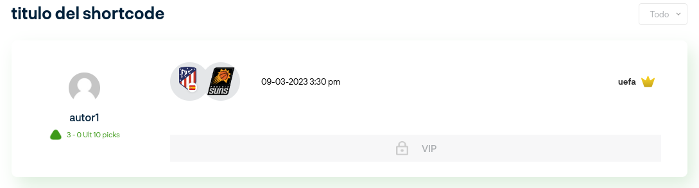

# documentación

## Bookmmaker Shortcodes

### [bookmakers]

| parámetros | detalle                                                                    |
|------------|----------------------------------------------------------------------------|
| num        | numero de items a mostrar                                                  |
| model      | debe ser numérico                                                          |
| country    | codigo alfabetico del pais, ejemplo UK,CO,EU |

### [banner_bookmaker]

| parámetros | detalle                                                                    |
|------------|----------------------------------------------------------------------------|
| id         | id del bookmaker,se selecciona automaticamente si se pinta en un single bk |

### [banner_bookmaker_payment_methods]

| parametros | detalle                                                                    |
|------------|----------------------------------------------------------------------------|
| id         | id del bookmaker,se selecciona automaticamente si se pinta en un single bk |

### [slide_bk]

| parametros | detalle                                                                    |
|------------|----------------------------------------------------------------------------|
| title      | titulo del shortcode |
| slogan     | slogan del shortcode |
| model      | numérico 1,2,3       |

## forecast shortcodes

### [forecasts]

#### model 1

| parametros | detalle                                                                    |
|------------|----------------------------------------------------------------------------|
| num        | items por página |
| league     | lo toma automaticamnete de la pagina donde se usa, o string all si desea mostrar todos los deportes y ligas |
| model      | numérico 1,2,3       |
| text_vip_link | texto que se mostrará en el boton de vip |
| filter     | string "yes", activa el filtro de fechas |
| title      | titulo del shortcode |
| date       | mustra los eventos segudel dia indicado, ayer, hoy o mañana |
| time_format | string "count", activa conteo regresivo de los eventos |

#### model 2

#### model 3

#### model 4

### [forecasts_vip]

#### model 1

| parametros | detalle                                                                    |
|------------|----------------------------------------------------------------------------|
| num        | items por página |
| league     | lo toma automaticamnete de la pagina donde se usa, o string all si desea mostrar todos los deportes y ligas |
| model      | numérico 1,2,3       |
| text_vip_link | texto que se mostrará en el boton de vip |
| filter     | string "yes", activa el filtro de fechas |
| title      | titulo del shortcode |
| date       | mustra los eventos segudel dia indicado, ayer, hoy o mañana |
| time_format | string "count", activa conteo regresivo de los eventos |
| unlock     | string "yes", muestra los eventos vip desbloqueados, default "locked" |

#### model 1 unlocked

## parley shortcodes

### [parley]

| parametros | detalle                                                                    |
|------------|----------------------------------------------------------------------------|
| num        | items por página |
| league     | lo toma automaticamnete de la pagina donde se usa, o string all si desea mostrar todos los deportes y ligas |
| model      | numérico 1,2,3       |
| text_vip_link | texto que se mostrará en el boton de vip |
| filter     | string "yes", activa el filtro de fechas |
| title      | titulo del shortcode |
| date       | mustra los eventos segudel dia indicado, ayer, hoy o mañana |

### [parley_vip]

#### unlocked

| parametros | detalle                                                                    |
|------------|----------------------------------------------------------------------------|
| num        | items por página |
| league     | lo toma automaticamnete de la pagina donde se usa, o string all si desea mostrar todos los deportes y ligas |
| model      | numérico 1,2,3       |
| text_vip_link | texto que se mostrará en el boton de vip |
| filter     | string "yes", activa el filtro de fechas |
| title      | titulo del shortcode |
| date       | mustra los eventos segudel dia indicado, ayer, hoy o mañana |
| unlock     | string "yes", muestra los eventos vip desbloqueados, default "locked" |

## Predicciones

### [predictions]

| parametros | detalle                                                                    |
|------------|----------------------------------------------------------------------------|
| id         | id del pronostico, si se usa en un pronostico, lo toma automaticamente |